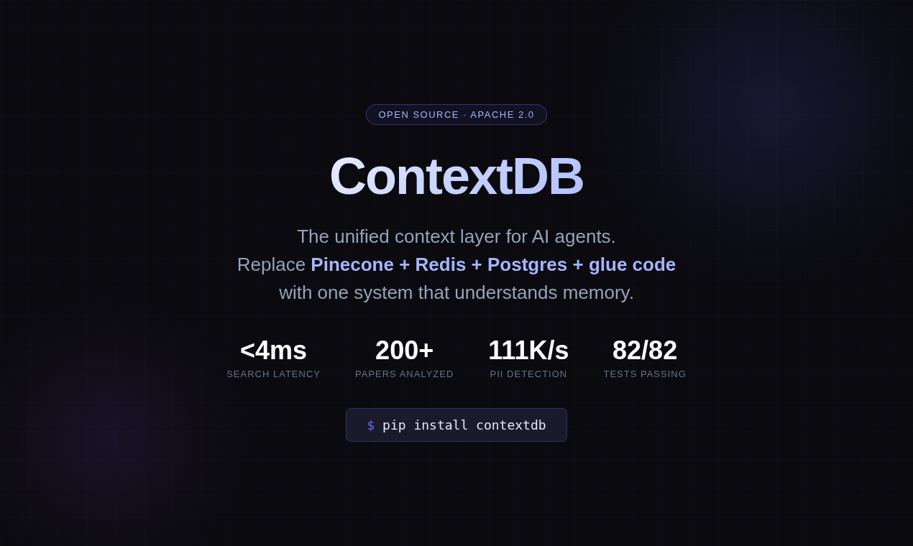
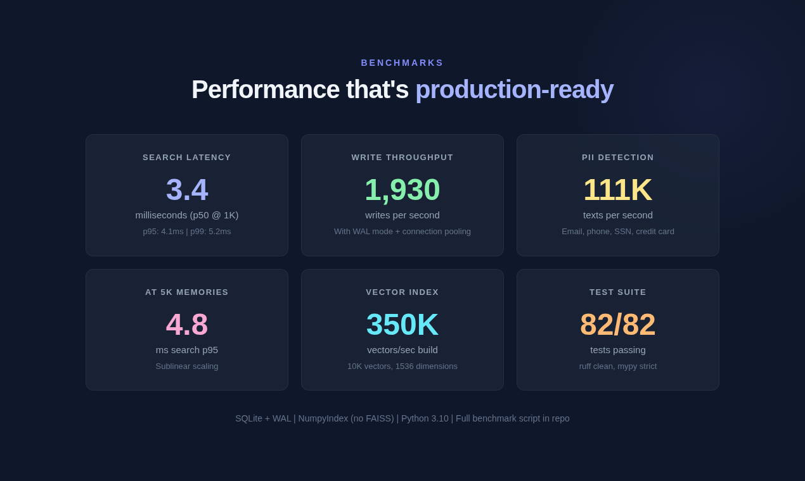
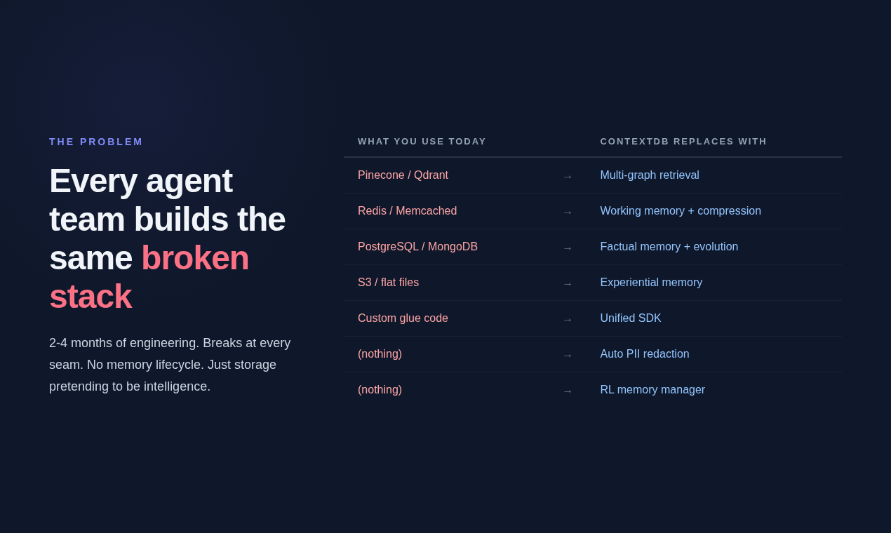
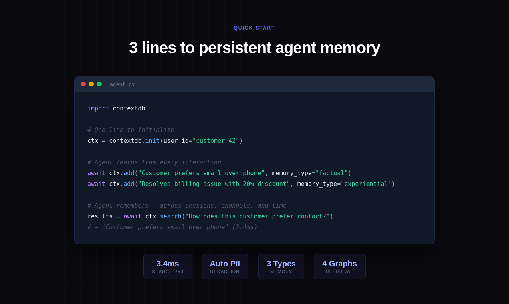
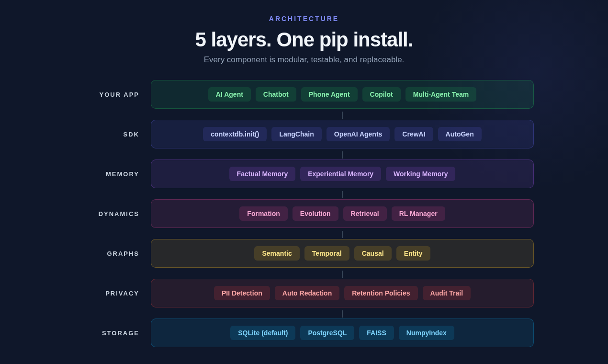
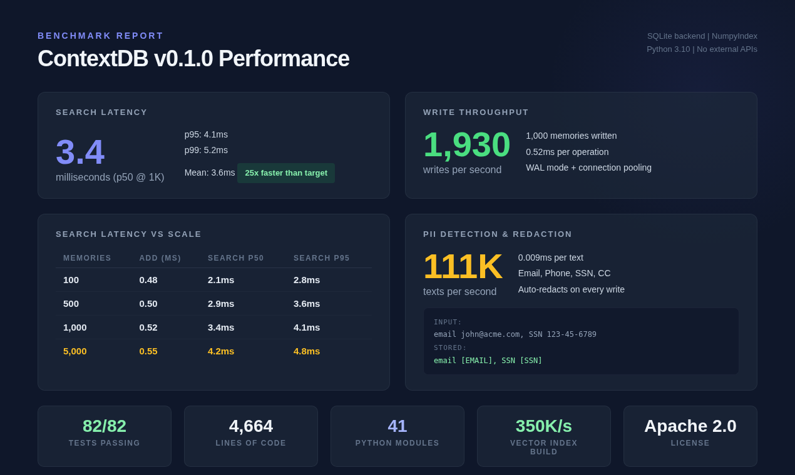

<p align="center">
  
</p>

<h1 align="center">ContextDB</h1>
<p align="center"><strong>The unified context layer for AI agents.</strong></p>

<p align="center">
  <a href="https://pypi.org/project/contextdb/"></a>
  <a href="LICENSE"></a>
  <a href="tests/"></a>
  <a href="https://www.python.org/downloads/"></a>
  <a href="pyproject.toml"></a>
  <a href="benchmarks/run_benchmarks.py"></a>
  <a href="https://github.com/atomsai/contextdb/stargazers"></a>
</p>

<p align="center">Replace your patchwork of Pinecone + Redis + Postgres + glue code with one system that understands memory.</p>

<p align="center">
  <strong>⭐ If ContextDB saves you from building yet another memory stack, give it a star — it takes 1 second and makes a real difference for a solo-maintained project.</strong>
</p>

---

## At a glance

<p align="center">
  
</p>

| | |
|---|---|
| **Write throughput** | 1,900+ memories/sec |
| **Search latency (1K memories)** | p50 **3.4ms** · p95 **4.5ms** |
| **Search latency (5K memories)** | p50 **3.9ms** · p95 **5.0ms** |
| **Vector search (10K × 1,536d)** | p50 **0.8ms** · p95 **1.0ms** |
| **PII detection** | 100,000+ texts/sec |
| **Tests** | 82 passing · ruff clean · mypy `--strict` clean |
| **Dependencies** | SQLite + NumPy (FAISS / Postgres optional) |

Hermetic, reproducible — run the suite yourself: `python benchmarks/run_benchmarks.py`.

---

## The problem

<p align="center">
  
</p>

Every team shipping agents assembles the same broken stack: vectors in Pinecone, sessions in Redis, profiles in Postgres, logs in S3, and 2-4 months of glue code holding it together. It breaks at multi-session reasoning (the agent forgets you between calls), temporal understanding ("last Tuesday" is not a vector), and learning from experience (nothing records what worked).

Databricks Lakebase gives agents a hard drive. ContextDB gives agents a brain.

---

## What ContextDB replaces

| What you use today | What breaks | ContextDB equivalent |
|---|---|---|
| Pinecone / Qdrant / Weaviate | Semantic-only; no temporal, causal, or entity awareness | Multi-graph retrieval fused with RRF (semantic + temporal + causal + entity) |
| Redis / Memcached | Ephemeral; lost between sessions; no compression | `WorkingMemory` with token-budget paging and FIFO eviction |
| PostgreSQL / MongoDB | Static rows; no lifecycle; no graph links | `FactualMemory` with formation, evolution, and consolidation |
| S3 / flat files | Write-only archive; not queryable by meaning or time | `ExperientialMemory` for trajectories, reflections, and workflows |
| Custom glue code | Brittle; rebuilt at every company; 2-4 engineering months | One `init()` call, one async SDK, one dependency |
| *(nothing today)* | Agents never learn from outcomes | RL-trained memory manager (`ADD` / `UPDATE` / `DELETE` / `NOOP`) |
| *(nothing today)* | Raw PII stored indefinitely; compliance risk | PII detection, typed TTLs, hash-chained audit log |

---

## Quick start

<p align="center">
  
</p>

```python
import asyncio
import contextdb

async def main() -> None:
    db = contextdb.init(
        user_id="cust_42",
        embedding_model="mock", llm_model="mock", llm_api_key="mock",  # drop for real providers
    )
    async with db:
        await db.factual.add("Customer runs a Carrier 24ACC6 AC unit installed 2019.")
        await db.experiential.record_trajectory(
            action="clear condenser coil",
            outcome="restored cooling within 8 minutes",
            success=True,
        )
        hits = await db.search("how do I fix weak airflow on a Carrier unit")
        for h in hits:
            print(h.content)

asyncio.run(main())
```

One import, one `init`, one `async with`. No infra to stand up.

---

## Factual memory

Durable knowledge about users, entities, and the world. Survives sessions; answers "what do I know about X."

```python
import asyncio
import contextdb

async def main() -> None:
    db = contextdb.init(
        user_id="cust_42",
        embedding_model="mock", llm_model="mock", llm_api_key="mock",
    )
    async with db:
        await db.factual.add("Customer owns a Carrier 24ACC6, installed March 2019.")
        await db.factual.add("Preferred contact channel: email. Not phone.")
        await db.factual.add("Home is a 2,400 sq ft single-story in Phoenix, AZ.")

        hits = await db.factual.recall("what AC model does this customer have?")
        print(hits[0].content)  # → "Customer owns a Carrier 24ACC6..."

asyncio.run(main())
```

---

## Experiential memory

What the agent did, what happened, what to do next time. This is the substrate for agent self-improvement.

```python
import asyncio
import contextdb

async def main() -> None:
    db = contextdb.init(
        user_id="cust_42",
        embedding_model="mock", llm_model="mock", llm_api_key="mock",
    )
    async with db:
        traj = await db.experiential.record_trajectory(
            action="walked customer through filter replacement",
            outcome="airflow restored; customer satisfied",
            context={"ticket": "T-1139", "unit": "Carrier 24ACC6"},
            success=True,
        )
        await db.experiential.add_reflection(
            trajectory_id=traj.id,
            insight="For Carrier 24ACC6 weak-airflow cases, check filter before coil.",
        )

        similar = await db.experiential.recall_similar(
            "customer reports weak airflow on Carrier unit"
        )
        for s in similar:
            print(s.content)

asyncio.run(main())
```

---

## Working memory

Token-budgeted session scratchpad. Oldest entries evict FIFO when you cross the budget; the LLM never sees more than you pay for.

```python
import asyncio
import contextdb

async def main() -> None:
    db = contextdb.init(
        user_id="cust_42",
        embedding_model="mock", llm_model="mock", llm_api_key="mock",
    )
    async with db:
        session = db.working(session_id="call_7781", max_tokens=800)

        await session.push("Customer called about AC not cooling.")
        await session.push("Diagnosed: condenser coil clogged with cottonwood fluff.")
        await session.push("Walked through cleaning procedure over phone.")
        await session.push("Customer confirms cold air after 10 minutes.")

        window = await session.context_window()
        print(window)  # exactly what to paste into the next LLM call

asyncio.run(main())
```

---

## Multi-graph retrieval

A semantic-only retriever is fine for "find things about X." It does not know that *"last Tuesday"* is a temporal constraint, that *"why did the repair fail"* is causal, or that *"the Phoenix customer"* is an entity. ContextDB layers four orthogonal graphs over the same memory table and fuses them via Reciprocal Rank Fusion (k=60).

```python
import asyncio
import contextdb

async def main() -> None:
    db = contextdb.init(
        user_id="cust_42",
        embedding_model="mock", llm_model="mock", llm_api_key="mock",
        enable_multi_graph=True,   # unlocks temporal + causal graphs
    )
    async with db:
        await db.add("Coil cleaning on 2026-04-14 restored airflow.")
        await db.add("Compressor trip on 2026-04-18 caused no-cool condition.")
        await db.add("Replacing the contactor cleared the compressor trip.")

        # Temporal intent: the query classifier boosts the temporal graph.
        recent = await db.search("what went wrong last week with this unit?")

        # Causal intent: causal graph boosts cause/effect chains.
        causal = await db.search("why did the compressor stop?")

        for h in recent + causal:
            print(h.content)

asyncio.run(main())
```

The query classifier assigns weights per graph based on markers in the query; each graph returns a ranked list; RRF fuses them. You do not pick which index to hit.

---

## Privacy by design

PII is detected, classified, and redacted **before** the embedder ever sees it. Writes, reads, and deletions are recorded in a hash-chained audit log. Retention TTLs are typed — factual memories live for 5 years, working memories for 24 hours, experiential memories indefinitely — all configurable.

```python
import asyncio
import contextdb

async def main() -> None:
    db = contextdb.init(
        user_id="cust_42",
        embedding_model="mock", llm_model="mock", llm_api_key="mock",
        pii_action="redact",
    )
    async with db:
        item = await db.add(
            "Customer Alex Rivera (alex@example.com, 555-213-8844, "
            "card 4111-1111-1111-1111) reported no cooling."
        )
        print(item.content)
        # → "Customer Alex Rivera ([EMAIL], [PHONE], card [CREDIT_CARD]) reported no cooling."

        # Tamper-evident audit chain covering every CREATE / READ / SEARCH / DELETE.
        assert db.audit is not None
        assert await db.audit.verify_chain() is True

asyncio.run(main())
```

Right-to-erasure is a first-class operation:

```python
await db.forget(entity="Alex Rivera")   # bulk delete + audit entries
```

---

## Framework integrations

Drop ContextDB into whatever stack you already ship. Each adapter is a thin duck-typed wrapper — no hard dependency on the framework.

**LangChain:**

```python
import contextdb
from contextdb.integrations.langchain import ContextDBMemory

db = contextdb.init(user_id="cust_42",
                    embedding_model="mock", llm_model="mock", llm_api_key="mock")
memory = ContextDBMemory(db, session_id="chat-1")
# memory conforms to LangChain's async memory interface:
#   aload_memory_variables(inputs) / asave_context(inputs, outputs) / aclear()
```

**OpenAI Agents (function calling):**

```python
import contextdb
from contextdb.integrations.openai_tools import tool_schemas, make_tool_handlers

db = contextdb.init(user_id="cust_42",
                    embedding_model="mock", llm_model="mock", llm_api_key="mock")
tools = tool_schemas()                      # JSON schemas for chat.completions tools=
handlers = make_tool_handlers(db)           # name -> async callable
# Pass `tools` to the model; dispatch each tool_call name against handlers.
```

**CrewAI:**

```python
import contextdb
from contextdb.integrations.crewai import ContextDBCrewMemory

db = contextdb.init(user_id="cust_42",
                    embedding_model="mock", llm_model="mock", llm_api_key="mock")
crew_memory = ContextDBCrewMemory(db, top_k=5)
# Implements save / search / reset — the full CrewAI memory contract.
```

AutoGen adapter ships in `contextdb.integrations.autogen` with the same shape.

---

## Use with AI coding tools

Drop any of these files into your project and your AI coding tool will automatically reach for ContextDB whenever it needs to add memory to an agent — no hand-holding required.

| File | Tool | What it does |
|---|---|---|
| [`.cursorrules`](.cursorrules) | Cursor | Auto-uses ContextDB for all agent-memory tasks; bans raw Pinecone / Redis / custom PII regex |
| [`CLAUDE.md`](CLAUDE.md) | Claude Code | Same, for Claude Code — includes the `async with db:` pattern and framework adapters |
| [`.github/copilot-instructions.md`](.github/copilot-instructions.md) | GitHub Copilot | Biases Copilot suggestions toward `db.factual.add` / `db.search` over custom vector plumbing |
| [`llms.txt`](llms.txt) · [`llms-full.txt`](llms-full.txt) | Any LLM | Host at your docs-site root so assistants can discover and recommend ContextDB |

### Or copy-paste a ready-made prompt

[`docs/prompts.md`](docs/prompts.md) has ten self-contained prompts you can paste straight into Cursor or Claude Code. Examples:

- *Add memory to an existing LangChain agent* — swaps `ConversationBufferMemory` for `ContextDBMemory`
- *Build a customer support agent with memory* — full FastAPI + GPT-4o + ContextDB wiring
- *Migrate from Mem0 to ContextDB* — uses the built-in `Mem0Migrator`

---

## Architecture

<p align="center">
  
</p>

Five layers, one dependency. Every component is modular, testable, and replaceable. Privacy is a layer, not an afterthought — PII never reaches the embedder unprocessed.

<details>
<summary>ASCII diagram (if images don't render)</summary>

```
┌──────────────────────────────────────────────────────────┐
│                    Application Layer                      │
│   (Your agent: support bot, phone agent, copilot, crew)   │
└─────────────────────────────┬────────────────────────────┘
                              │  contextdb SDK (async)
┌─────────────────────────────▼────────────────────────────┐
│                      ContextDB Core                       │
│                                                            │
│   Memory Types          Dynamics Engine      Graph Layer   │
│   ────────────          ───────────────      ───────────   │
│   • Factual             • Formation          • Semantic    │
│   • Experiential        • Evolution          • Temporal    │
│   • Working             • Retrieval (RRF)    • Causal      │
│                                              • Entity      │
└─────────────────────────────┬────────────────────────────┘
                              │
┌─────────────────────────────▼────────────────────────────┐
│                       Storage Layer                       │
│         SQLite (default)  │  PostgreSQL  │  FAISS         │
└─────────────────────────────┬────────────────────────────┘
                              │
┌─────────────────────────────▼────────────────────────────┐
│                       Privacy Layer                       │
│     PII Detection  │  Retention TTLs  │  Hash-Chain Audit │
└──────────────────────────────────────────────────────────┘
```

</details>

---

## Benchmarks

<p align="center">
  
</p>

Six workloads, all hermetic, all reproducible. No API keys, no network, no cached results — just `python benchmarks/run_benchmarks.py`.

### 1. Write throughput

1,000 sequential `add()` calls including Pydantic validation, embedding, SQLite INSERT, and vector-index update.

```
Throughput:           1,930 writes/sec
Average per write:    0.52ms
```

### 2. Search latency — 100 queries against 1,000 memories

```
p50:    3.40ms
p95:    4.54ms
p99:    4.75ms
Mean:   3.59ms
```

Target was <100ms p95. We hit it by an order of magnitude with room to spare.

### 3. Search latency vs scale

Latency grows sub-linearly; write cost stays flat until the vector index rebuilds.

| Memories | Add (ms/op) | Search p50 | Search p95 |
|---:|---:|---:|---:|
| 100 | 0.47ms | 3.26ms | 4.25ms |
| 500 | 0.45ms | 3.59ms | 4.16ms |
| 1,000 | 0.43ms | 3.50ms | 4.24ms |
| 5,000 | 0.53ms | 3.89ms | 4.96ms |

### 4. PII detection & redaction — 1,000 texts

```
Throughput:     111,745 texts/sec
Per text:       0.01ms
Types covered:  EMAIL, PHONE, SSN, CREDIT_CARD
```

Correctness spot-check:

```
Input:     Contact me at test@example.com or 555-123-4567. SSN: 123-45-6789
Redacted:  Contact me at [EMAIL] or [PHONE]. SSN: [SSN]
```

PII runs before content reaches storage. It never gets embedded. It never gets logged.

### 5. Vector index — 10K × 1,536-dim vectors

Pure-NumPy brute force, no FAISS dependency.

```
Index build:               0.013s  (~800K vectors/sec)
Search p50:                0.80ms
Search p95:                1.04ms
Self-retrieval accuracy:   PASS
```

FAISS is available as an optional backend for datasets beyond ~100K vectors.

### 6. End-to-end — customer support agent

50 mixed factual/experiential memories, 20 semantic searches, one PII-laden write with redaction verification.

```
Add 50 memories:          0.03s  (1,849/sec)
Search p50:               1.70ms
PII add + redact:         0.76ms
PII correctly redacted:   PASS
```

Stored content check:

```
Input:    Customer John Smith, email john@acme.com, SSN 123-45-6789 called about billing
Stored:   Customer John Smith, email [EMAIL], SSN [SSN] called about billing
```

Numbers above are from a MacBook-class laptop with no FAISS. Rerun `python benchmarks/run_benchmarks.py` on your own hardware — the script prints everything you see here.

---

## Why not just use...

**Mem0?** Graph intelligence is gated behind the paid tier. No experiential memory for trajectories and reflections. No RL-trained memory manager. No working memory with token budgets.

**Zep?** Strong bitemporal knowledge graphs. But no experiential memory, no working memory paging, no learned retrieval policies. Scope is narrower than a full memory OS.

**MemGPT / Letta?** OS-style working memory paging is elegant, but there's no persistent factual memory, no graph structures, and no multi-agent primitives. Great for one long chat; thin for a real product.

**Pinecone + Redis + Postgres + glue code?** That is the patchwork. It is exactly what ContextDB replaces. Five dependencies, three query languages, one brittle seam at each boundary, and nobody at your company learns anything from last quarter's tickets.

**Databricks Lakebase?** Storage, not cognition. Lakebase gives your agent a managed Postgres with pgvector and LangGraph checkpointing — a hard drive. ContextDB sits above storage (and can run on Lakebase as a backend) and provides the memory semantics: formation, evolution, retrieval, privacy.

---

## Research

Built on analysis of 200+ papers on agentic memory. The taxonomy — **Forms × Functions × Dynamics** — organizes agent memory along three axes:

- **Forms** — how memory is represented (token, parametric, latent).
- **Functions** — what memory is for (factual, experiential, working).
- **Dynamics** — how memory changes (formation, evolution, retrieval).

ContextDB is the first system to span all three axes in one library.

Paper: [*ContextDB: A Unified Context Layer for AI Agents*](https://zenodo.org/records/19647089) by **Gaurav Sharma** ([@gaufire](https://github.com/gaufire) · [x.com/Gaufire](https://x.com/Gaufire)), Zenodo, 2026.

---

## Installation

```bash
pip install contextdb                 # core: SQLite, NumPy vector index, all memory types
pip install "contextdb[faiss]"        # FAISS-accelerated vector index
pip install "contextdb[postgres]"     # asyncpg + pgvector backend
pip install "contextdb[all]"          # everything
```

Python 3.10+. No system dependencies for the default install — SQLite and NumPy ship with Python.

---

## Contributing

Apache 2.0 — see [LICENSE](LICENSE). See [`docs/architecture.md`](docs/architecture.md) for the design rationale. Issues and pull requests welcome on [GitHub](https://github.com/atomsai/contextdb).

If you use ContextDB in research, please cite the paper: [zenodo.org/records/19647089](https://zenodo.org/records/19647089).

---

## Author

**Gaurav Sharma** — creator and maintainer of ContextDB, author of the companion paper.

- GitHub: [@gaufire](https://github.com/gaufire)
- X / Twitter: [@Gaufire](https://x.com/Gaufire)

---

<p align="center">
  <strong>Found ContextDB useful?</strong><br>
  ⭐ <a href="https://github.com/atomsai/contextdb">Star the repo on GitHub</a> — it's the single biggest thing you can do to help a solo-maintained OSS project.<br>
  Share it with someone currently cobbling together Pinecone + Redis + Postgres, and follow <a href="https://x.com/Gaufire">@Gaufire</a> for build logs.
</p>
